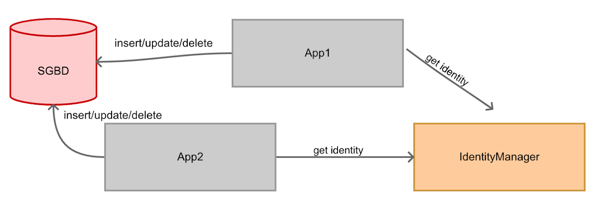

# Sistemas Distribuidos - Atividade Performance com RMI
Implementação da atividade Performance com RMI

## Atividade
 Com base na topologia informada na imagem abaixo:

- O Gerenciador de Identidade, que possui a função única de CRIAR UM NOVO ID, nunca repetido e sequencial - deve ter um mecanismo para garantir que a identidade foi usada realmente
- Use apenas LocateRegistry para registrar e encontrar os serviços (não use Naming)
- Cada projeto deve representar uma aplicação

## Resultados
| Cliente          | Procedimento                   | Resultados   |
| ------------- |:--------------------------| :----------:|
| App1     | 1000 inserções, atualizaçoes e remoções simultaneas | 7759 milissegundos (7.7 segundos) |
| App2     | 1000 inserções, atualizaçoes e remoções simultaneas | 7583 milissegundos (7.5 segundos) |

## Execução

**1 - Executar servidor (IdentityManager)**
- Na raiz do projeto, executar o seguinte comando `sh run-serve.sh`

**2 - Executando clientes (App1 e App2)**
- Em outro terminal aberto, executar o seguinte comando `sh run-clients.sh`

## Equipe
* [Fernanda Vieira](https://github.com/fernandasj) 

* [Rogério Araújo](https://github.com/rodgeraraujo) 
